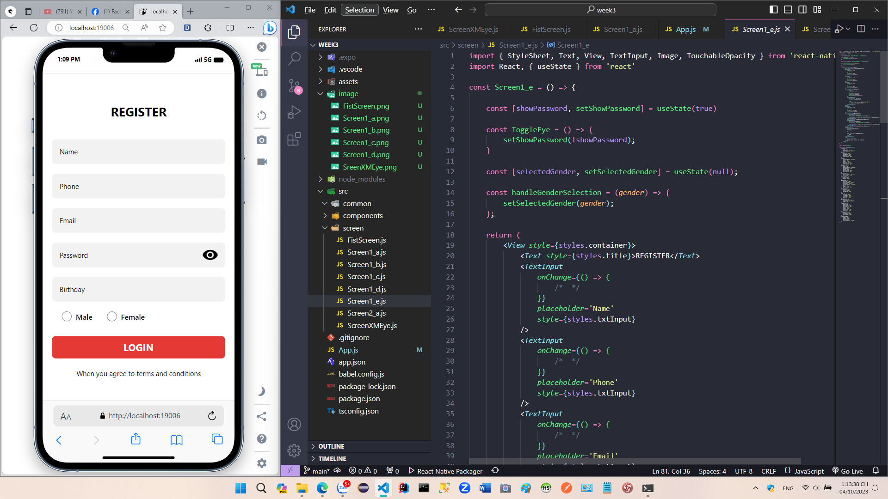

# Sample React native UI - Lab3 Mobile

Lập trình thiết bị di động với React-native lab-3

## Mô Tả Dự Án

- Thiết kế ác màn hình cơ bản với react-native
- Áp dụng flex box
- Sử dụng các core component của react native
- Sử dụng Icon từ material-UI
- Sử dụng hooks useState để xử lý một vài chức năng

## Các thành phần chính 

Dưới đây là danh sách các thành phần đã làm:

- FistScreen : 

- Screen1_a : 

- Screen1_b : 

- Screen1_c : 

- Screen1_d : 

- Screen1_e : 

- Screen2_a : 

- ScreScreenXMEyeen : 

## Hướng Dẫn Cài Đặt

- Clone repository :
Mở cmd trong thư mục cần lưu và chạy lệnh : `git clone https://github.com/nhatlinhdev201/ltdd_lab03.git`

Di chuyển vào ứng dụng, chạy lệnh `cd ltdd_lab03`

- Tải các modules ứng dụng :
Tại cmd chạy lệnh `npm install`

- Chạy ứng dụng : 
Chạy lệnh : `npm run web`

## Hướng Dẫn Sử Dụng
- Các màn hình chính lưu tại folder screen :

- Tại file App.js, thực hiện thay thế các màn hình để kiểm tra 

